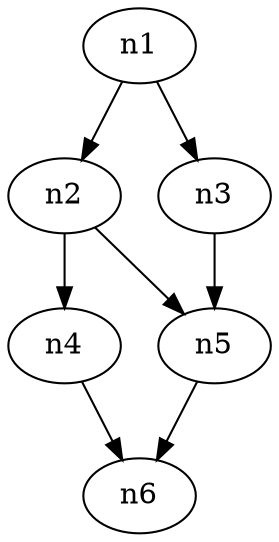
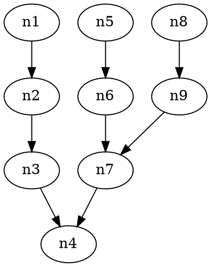
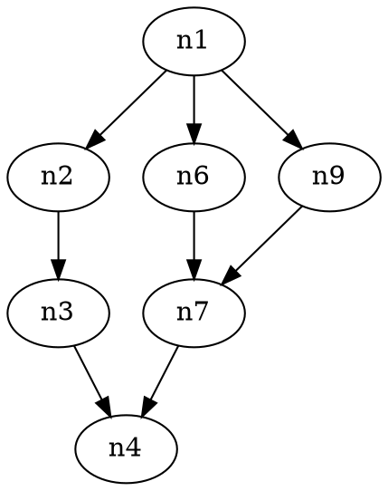
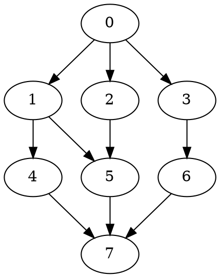
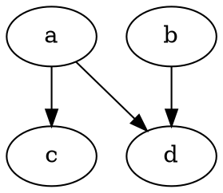

# SP-ization

As a refresher, a series-parallel decomposition (SPD) is an algebraic datatype that looks as follows:
```haskell
data ParallelChild = Node | Series SeriesChild SeriesChild
data SeriesChild = Node | Parallel ParallelChild ParallelChild

data SPD = Series SeriesChild SeriesChild |
           Parallel ParallelChild ParallelChild |
           Node
```

SP-ization is the process of transforming a DAG into a series-parallel decomposition (SPD), such that the dependencies present in the original DAG are preserved in the SPD.
Each node in the SPD may optionally have an associated cost, which is a positive scalar value.

Note that SP-ization is itself trivial (e.g. a topological sort of the nodes is an SPD). But we generally care about preserving as much of the structure / parallelism of the original DAG as possible. So, there are 2 properties that we care about:
1. **Work**: the sum of cost of nodes in the SPD
2. **Critical Path Cost**: the cost of the longest path in the SPD

We have 2 main ways of achieving this:
1. **Work (Node) Duplicating SP-ization**: preserves the critical path, but may duplicate nodes
2. **Dependency (Edge) Addition SP-ization**: preserves the set of nodes, but may add edges

## Node (Work) Duplicating SP-ization

### Naive ([work_duplicating_spization.h](work_duplicating_spization.h))

Transforms a directed acyclic graph (DAG) into a Series Parallel (SP) graph. The critical path cost is unchanged, and the SP-ization is done solely through node duplication.

The resulting graph, encoded as a SeriesParallelDecomposition, is a tree whose critical path is the same as that of the original graph. The tree is constructed as follows:
- Denote SP(n) as the SeriesParallelDecomposition of the subgraph of g whose nodes are all the ancestors of n.
- Denote the predecessors of n as M.
- Then:
  - SP(n) = S(n, P({SP(m) for m in M}))
  - SP(root) = root
  - SP(sink) = SP(g)
Where P, S represent parallel, serial composition respectively.

Example:

becomes


We can roughly think of it as the parallel composition of all the possible paths from source to sink.

### With Coalescing ([work_duplicating_spization.h](work_duplicating_spization.h))

Transforms a directed acyclic graph (DAG) into a Series Parallel (SP) graph with coalescing. The critical path cost is unchanged, and the SP-ization is done solely through node (work) duplication.

This SP-ization technique, compared to the previous step, adds an additional coalescing step during parallel composition to reduce node duplication. The recursive formulation is equivalent, but the parallelization performs an additional coalescing step, where parallel strands with common heads are merged together. Example: P(S(1,2), S(1,3)) -> P(1, S(2,3)).

Example:

becomes


## Dependency Addition SP-ization

### Naive Stratum Sync ([naive_stratum_sync.h](naive_stratum_sync.h))

Transforms a directed acyclic graph (DAG) into a Series Parallel (SP) graph. The total number of nodes remains unchanged, and the SP-ization is done solely through edge (dependency) addition.

The graph is first partitioned into strata: the i_th stratum contains all the nodes whose critical path length has length i. The nodes in a given stratum are composed in parallel, and the strata are serially composed in succession.

Example:

becomes


### Escribano Algorithm ([escribano_algo.h](escribano_algo.h))

Paper is present here: https://www.infor.uva.es/wp-content/uploads/2016/10/IT-DI-2002-0002.pdf.
In the naive stratum sync algorithm, we add an all-to-all connection between all nodes in one stratum and the next. The escribano algorithm by contrast, leverages the fact that it might be possible to synchronize consecutive strata by adding smaller, more local connections that still yield a valid SP-ization graph.

Example:


The strata are: {0}, {1, 2, 3}, {4, 5, 6}, {7}.

The naive stratum sync yields the following, adding an all-to-all connection between consecutive strata:
```
S(0, P(1, 2, 3), P(4, 5, 6), 7)
```

While the escribano algorithm is able to identify that strata 1 and 2 can be synced without adding an all-to-all connection: nodes {1, 2} only connect to {4, 5}, and node {3} only connects to {6}. It thus yields the following:
```
S(0, P(S(P(1, 2), P(4, 5)), S(3, 6)), 7)
```

Our implementation, rather than building the SPD one stratum at a time, builds it one node at a time.

### Flexible Algorithm ([flexible_algo.h](flexible_algo.h))

Consider the following N-graph:



Note that there are multiple valid SP-izations for this.
1) S(P(a, b), P(c, d)) — adds edge (b, c)
2) S(P(S(a, c), b), d) — adds edge (c, d)
3) S(a, P(c, S(b, d))) — adds edge (a, b)
(you could also simply turn the graph into a straight line, but it's a strictly worse SP-ization than the others present here, so we'll ignore it)

Depending on the cost map, each option can potentially be the best:
- {a:1, b:1, c:1, d:1}: SP1 is optimal (CP=2), SP2 and SP3 worsen it (CP=3)
- {a:1, b:3, c:2, d:1}: SP2 is optimal (CP=4), SP1 and SP3 worsen it (CP=5)
- {a:1, b:2, c:3, d:1}: SP3 is optimal (CP=4), SP1 and SP2 worsen it (CP=5)

Thus, even for this simple graph, the best SP-ization depends on the cost map.

The flexible algorithm expands the escribano algorithm by generalizing it to such weighted DAGs.

In the escribano algorithm, once the sync area (the "forest") is identified, the partition into up and down sets is fixed: up is everything but the last layer, down is the last layer. But this is an arbitrary choice; there are multiple valid ways to partition the forest into an up set and a down set (across which we sync).

The flexible algorithm exploits this by searching across all valid up/down partitions of the forest and selecting the one that minimizes the sum of critical path costs of the up and down subgraphs (i.e., the critical path cost of the resulting SP-ized subgraph after the sync).
